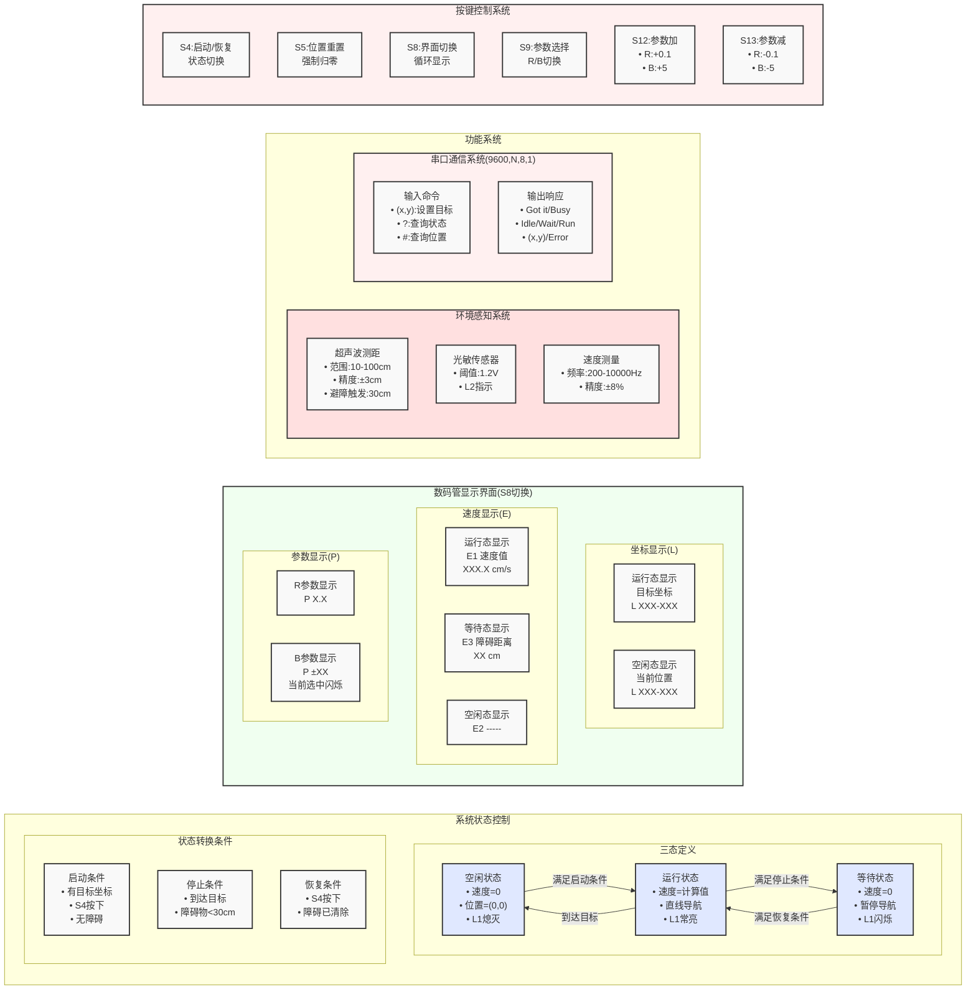

```mermaid
flowchart LR
    %% 核心状态管理
    subgraph 状态管理["系统状态控制"]
        direction TB
        subgraph 状态定义["三态定义"]
            direction LR
            idle["空闲状态\n• 速度=0\n• 位置=(0,0)\n• L1熄灭"]
            running["运行状态\n• 速度=计算值\n• 直线导航\n• L1常亮"]
            waiting["等待状态\n• 速度=0\n• 暂停导航\n• L1闪烁"]
        end
        
        subgraph 状态转换["状态转换条件"]
            direction TB
            start_cond["启动条件\n• 有目标坐标\n• S4按下\n• 无障碍"]
            stop_cond["停止条件\n• 到达目标\n• 障碍物<30cm"]
            resume_cond["恢复条件\n• S4按下\n• 障碍已清除"]
        end
    end

    %% 显示系统
    subgraph 显示系统["数码管显示界面(S8切换)"]
        direction TB
        subgraph 坐标界面["坐标显示(L)"]
            coord_run["运行态显示\n目标坐标\nL XXX-XXX"]
            coord_idle["空闲态显示\n当前位置\nL XXX-XXX"]
        end
        
        subgraph 速度界面["速度显示(E)"]
            speed_run["运行态显示\nE1 速度值\nXXX.X cm/s"]
            speed_wait["等待态显示\nE3 障碍距离\nXX cm"]
            speed_idle["空闲态显示\nE2 -----"]
        end
        
        subgraph 参数界面["参数显示(P)"]
            param_r["R参数显示\nP X.X"]
            param_b["B参数显示\nP ±XX\n当前选中闪烁"]
        end
    end

    %% 水平排列传感器和串口系统
    subgraph 功能系统["功能系统"]
        direction LR
        subgraph 传感器系统["环境感知系统"]
            direction TB
            超声波["超声波测距\n• 范围:10-100cm\n• 精度:±3cm\n• 避障触发:30cm"]
            光敏["光敏传感器\n• 阈值:1.2V\n• L2指示"]
            速度计["速度测量\n• 频率:200-10000Hz\n• 精度:±8%"]
        end

        subgraph 串口系统["串口通信系统(9600,N,8,1)"]
            direction TB
            cmd_in["输入命令\n• (x,y):设置目标\n• ?:查询状态\n• #:查询位置"]
            cmd_out["输出响应\n• Got it/Busy\n• Idle/Wait/Run\n• (x,y)/Error"]
        end
    end

    %% 按键控制
    subgraph 按键系统["按键控制系统"]
        direction TB
        key_s4["S4:启动/恢复\n状态切换"]
        key_s5["S5:位置重置\n强制归零"]
        key_s8["S8:界面切换\n循环显示"]
        key_s9["S9:参数选择\nR/B切换"]
        key_s12["S12:参数加\n• R:+0.1\n• B:+5"]
        key_s13["S13:参数减\n• R:-0.1\n• B:-5"]
    end

    %% 主要关联关系
    idle --> |"满足启动条件"| running
    running --> |"满足停止条件"| waiting
    waiting --> |"满足恢复条件"| running
    running --> |"到达目标"| idle

    %% 样式定义
    classDef default fill:#f9f9f9,stroke:#333,stroke-width:2px
    classDef state fill:#e0e8ff,stroke:#333,stroke-width:2px
    classDef interface fill:#f0fff0,stroke:#333,stroke-width:2px
    classDef sensor fill:#ffe0e0,stroke:#333,stroke-width:2px
    classDef control fill:#fff0f0,stroke:#333,stroke-width:2px
    
    class idle,running,waiting state
    class 显示系统 interface
    class 传感器系统 sensor
    class 按键系统,串口系统 control
```

